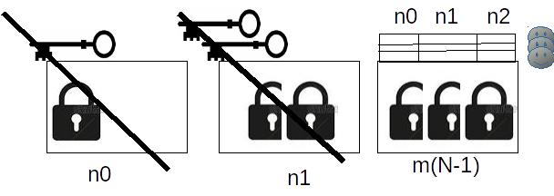

###Scale Key Size Protocol (sksp) -
#### making the strength measured by key size a choice of the user - under [humanitarian agpl](http://namzezam.wikidot.com/humanitarian-agpl-license).

- **Problem:** increasing privacy strength, even though the a/symmetric key sizes are somewhat limited by default/regulation/implementation etc (to decrease the ruler power of the statistics feeding the AI-big-brother-golem serving the corporations-and-governments two-heads-hydra capturing humanity in disasters).
- **Solution:** letting the user to chose **N** to magnify the strength derived from key size, such that
	- N can be chosen for specific case of communication, messages and participants etc, while being demonstrated as weight of keys measured by the required time to compute with these keys in some specific environment;
	- N is the number of rounds to re-encrypt with different symmetric for asymmetric keys of sevral users, where
	- 0 <= n < N,
	- m(0) is the padded plaintext (default to 32),
	- k(n)  = [hash](https://en.wikipedia.org/wiki/List_of_hash_functions)(m(n),rnd(n)) is used as symmetric key (default SHA-3 ),
	- m(n+1) = symmetric_encrypt(m(n),k(n)) (default aes256/Twofish),
	- r(u,n) is the encrypted k(n) with the public-key(n) of the user u, (default rsa), 
	-  b(u) is a block of all r(u,n) per u starting with the size of all b(u),
	- only m(N-1)  after all b(u) are kept.

